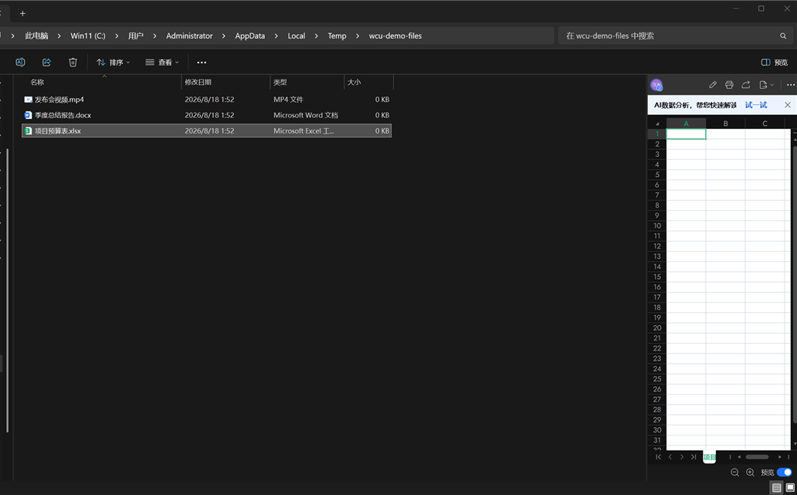
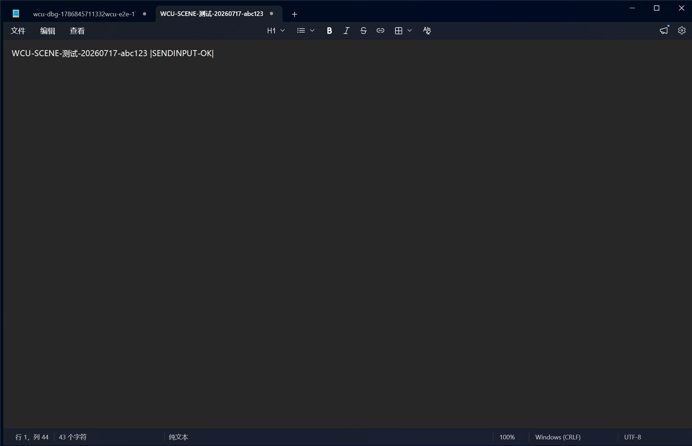

# dsh-computer-use-win — 给 DeepSeek Harness 装上 Windows 电脑操控能力

[](https://github.com/Yu-tao-Li/dsh-computer-use-win/actions/workflows/ci.yml)
<!-- 上架 awesome-dsh-plugin 后启用：
[](https://awesome-dsh-plugin.com)
-->

**English:** A Windows computer-use plugin for [DeepSeek Harness](https://github.com/deepseek-ai/deepseek-harness) (`dsh`): an MCP stdio server backed by a PowerShell UI Automation engine. It gives the agent 22 desktop tools — accessibility tree, window-cropped screenshots, mouse/keyboard input (foreground + verified background paths), OCR with word boxes, window management, coordinate homing, an identity guard, and a physical-cursor failsafe. Bridges into DSH through the in-box `@deepseek-ai/dsh-mcp-client`; no DSH modifications.

**中文**: 一个 **MCP（Model Context Protocol）stdio 服务器 + PowerShell UIA 后端**，让 DSH agent 能
"看"（UIA 无障碍树 + 截图）和"做"（鼠标 / 键盘 / 语义点击）Windows 桌面应用。
通过 DSH 内置的 `@deepseek-ai/dsh-mcp-client` 桥接进 DSH，**无需改 DSH 本体**。

## 截图

| 窗口裁剪截图 + UIA 树（`snapshot`） | OCR 回退（中文界面识别 + 词框坐标） |
|---|---|
|  |  |

```
DSH agent (本 GUI)
   │  模型看到 mcp__wincu__windows_computer_use_* 工具
   ▼
@deepseek-ai/dsh-mcp-client   ← DSH 内置插件（官方 @modelcontextprotocol/sdk 的 StdioClientTransport）
   │  JSON-RPC 2.0 over stdio（按行分帧的 JSON）
   ▼
mcp/server.mjs                ← 本项目：MCP 服务器（Node ≥18，零依赖）
   │  spawn powershell.exe -NoProfile -File windows-uia.ps1 -Action <动作>
   │  参数走 stdin（JSON），结果走 stdout（JSON）
   ▼
scripts/windows-uia.ps1       ← 本项目：Windows 桌面引擎（PowerShell 5.1 兼容）
   ├─ UI Automation（UIAutomationClient/UIAutomationTypes 程序集）→ 无障碍树
   ├─ user32 P/Invoke（SetCursorPos / mouse_event）→ 鼠标
   ├─ WinForms SendKeys + 剪贴板粘贴 → 键盘与 Unicode 文本
   └─ System.Drawing.CopyFromScreen → 全屏截图（PNG）
```

## 原理（为什么这样做）

### 1. 为什么走 MCP 桥接，而不是原生 DSH 插件
- DSH 一切皆插件，但"注册新工具"需要写 Cordis 插件（注册进 `ctx.tools`、
  处理审批与权限钩子、打包成 `dsh.bundle`）。MCP 是更薄的边界：
  官方 `dsh-mcp-client` 会把任意 MCP server 的工具**原样注册**成
  `mcp__<serverName>__<工具名>`（serverName 我们在 patch 里取 `wincu`）。
- 好处：后端独立进程、独立语言、可单独测试（`--self-test`），坏了不影响 DSH 启动
  （`failOnStartupError: false`）。
- 代价：MCP 工具没有 DSH 原生的审批/风险分级钩子，所以安全机制做在 server 内部
  （scope 限定、窗口定位、动作前观察）。

### 2. 感知：UIA 无障碍树（text-first）
Windows 上比"截图像素"更可靠的是 **UI Automation** 树：每个控件带
`controlType`（Button/Edit/Window…）、`name`、`automationId`、`boundingBox`、
`value`、`patterns`（支持哪些语义操作）。agent 可以**按语义找控件**而不是猜坐标：

- 三种视图：`control`（默认，应用控件级，最常用）/ `content`（最终用户内容）/ `raw`（含内部节点）
- 元素 id 是**树路径**：`uia:active.0.2.1`（当前活动窗口下的第 0→2→1 个子控件）。
  注意路径会随 UI 刷新变化（stale），动作前最好重新 snapshot。
- `find` 工具在树里按 name/automationId/class/值 做大小写不敏感子串搜索，
  返回完整节点信息，适合"找到保存按钮"这类任务。
- 截图（`snapshot`）同时给出 PNG **文件路径**——因为 DSH 的 dsh-mcp-client
  会丢弃 MCP 的 image 内容块（只留占位符），所以视觉信息要么让模型用 `read_image`
  读该 PNG，要么依赖 UIA 文本（推荐，纯文本模型也能干活）。

### 3. 动作：三条路径
| 路径 | 用什么 | 何时用 |
|---|---|---|
| 坐标 | `SetCursorPos` + `mouse_event` P/Invoke | 点元素中心或任意屏幕点 |
| 语义 | UIA patterns：`Invoke`/`Toggle`/`SelectionItem`/`ExpandCollapse`/`Value` | 优先！不碰鼠标、更稳 |
| 文本 | 剪贴板写入 + `Ctrl+V`（自动还原剪贴板），键组合走 `SendKeys` 语法（`^%+`） | 输入含中文/长文本时最可靠 |

`invoke`/`set_value` 带 fallback：pattern 不存在时退回"点中心"或"聚焦+全选+粘贴"。
`keypress` 支持 `["ctrl","shift","s"]` 这类键组合（Win 键不支持，SendKeys 限制）。

### 4. 窗口定位
所有工具都接受可选 `windowTitle`（子串）/ `processId` / `nativeWindowHandle`
指定目标顶层窗口，`activate: true` 可先置前台。不指定 = 当前前台窗口
（`scope: active_window`；`scope: desktop` = 整个桌面树）。

### 5. 三个真实踩过的坑（安全加固）
computer use 在 Windows 上最阴险的失败都是**静默的**——返回 ok 但实际打错了地方。
本项目内置了三层防御，全部经过本机实测验证：

1. **前台锁（foreground lock）**：后台进程调 `SetForegroundWindow` 会被 Windows
   前台锁**静默拒绝**——函数不报错，但窗口根本没切过去，后续按键就全打进了
   用户当前的前台窗口（可能是微信、浏览器）。
   修复：`AttachThreadInput` 把前台窗口输入线程挂到自己线程 + 模拟按下/抬起
   Alt 键解锁（AutoHotkey 经典技巧）+ `ShowWindow`/`SetForegroundWindow`。
   切完**校验前台是否真的变成目标窗口**，结果以 `activated: true/false` 返回。
2. **fail-closed 输入守卫**：`type_text`/`keypress` 一旦指定了目标窗口，
   发送前校验"前台 == 目标"，不匹配直接抛错，**绝不**把按键打进别的窗口；
   `activate:true` 激活失败同样抛错。
3. **激活 ≠ 聚焦**：窗口置前台后，内部编辑框往往**没有键盘焦点**
   （焦点可能停在菜单栏/标题栏），`Ctrl+V` 会被无声吞掉。
   修复：`type_text` 在目标窗口内用 UIA 找**最大的启用状态 Edit/Document
   控件**并 `SetFocus()`，结果里回报 `focusedControl`（如 `Document`）。
   实测：新记事本的编辑区是 `RichEditD2DPT` 的 Document 节点。

## 工具清单（22 个，前缀 `mcp__wincu__`）

| 工具 | 说明 |
|---|---|
| `windows_computer_use_health` | 自检：UIA / 截图 / 前台窗口 / 能力上报 |
| `windows_computer_use_snapshot` | 截图 + UIA 树（主力"观察"工具；捕获链 PrintWindow→WGC→屏幕区域，`captureWindow`/`maxWidth` 裁剪降采样） |
| `windows_computer_use_accessibility_tree` | 只取 UIA 树，不截图 |
| `windows_computer_use_list_windows` | 顶层窗口列表 |
| `windows_computer_use_find` | 按关键词/控件类型找元素（树稀疏时自动提示改用 OCR） |
| `windows_computer_use_element_info` | 查某个 id 或坐标处的元素 |
| `windows_computer_use_click` / `double_click` / `move` / `drag` / `scroll` | 鼠标动作（`elementId` 或 `x,y`；`dispatch: auto/foreground/background`；坐标 homing 补偿） |
| `windows_computer_use_type_text` | 输入文本（`method: clipboard/sendinput/background`；sendinput 走 KEYEVENTF_UNICODE 不碰剪贴板，background 走 WM_CHAR 不碰前台） |
| `windows_computer_use_keypress` | 键/键组合（`["ctrl","s"]`；Win 键被黑名单拦截） |
| `windows_computer_use_focus` / `invoke` / `set_value` | UIA 语义动作 |
| `windows_computer_use_activate_window` | 把指定窗口置前台（前台锁破解 + 校验） |
| `windows_computer_use_move_window` | 移动窗口（不抢前台） |
| `windows_computer_use_close_window` | 优雅关窗（PostMessage WM_CLOSE，应用可弹保存对话框否决） |
| `windows_computer_use_ocr` | Windows.Media.Ocr 文字识别（UIA 盲区回退；返回文字 + 屏幕坐标词框） |
| `windows_computer_use_wait_for` | 服务端轮询等窗口出现/消失（省往返） |
| `windows_computer_use_wait` | 等待 N ms |

### 本轮新增的鲁棒性/兼容性能力

- **坐标 homing**（借鉴 desktop-touch-mcp）：观察窗口时缓存其位置，动作时若窗口被
  移动过就自动补偿 `dx,dy`，结果里回报 `homed: {dx,dy}`。实测窗口移动 (+120,+80)
  后旧坐标点击被正确补偿。
- **急停 failsafe**（借鉴 desktop-touch-mcp）：物理鼠标停在虚拟屏左上角
  （默认半径 12px）超过 500ms → 所有输入动作被拒（`EMERGENCY STOP`），
  移开即恢复。可用 `WCU_FAILSAFE_CORNER="x,y"` / `WCU_FAILSAFE_RADIUS` /
  `WCU_FAILSAFE_HOLD_MS` 配置，`WCU_FAILSAFE=0` 关闭。
- **OCR 回退**（借鉴 PeekabooWin / iris-mcp）：游戏/自绘 Tk/Qt/RDP 等 UIA 盲区
  应用，`find` 返回稀疏树时会提示改用 `ocr` 工具；OCR 用编译进缓存 DLL 的
  C# WinRT 助手（Windows.Media.Ocr）实现，词框坐标自动换算回屏幕坐标。
  实测中文界面识别正常。
- **PostMessage 后台 dispatch**（借鉴 cua / desktop-touch-mcp）：
  `dispatch:'background'` 把鼠标消息直接 PostMessage 进目标窗口消息队列
  （不碰系统输入队列、不抢前台）；`type_text method:'background'` 走 WM_CHAR。
  投递是**未验证**的（Chromium/Electron/WinUI 可能丢弃合成消息，如新记事本
  会丢 WM_CHAR）——结果里显式 `verified:false` + 提示，被拒时报
  `background_unavailable` 让你显式切 `foreground`（cua 的诚实报错模式）。
  实测后台 PostMessage 点击真实打开了记事本菜单（UIA 可见）。
- **坐标映射修正**：移动改用 `SetCursorPos`（原始屏幕坐标），弃用 SendInput
  ABSOLUTE 归一化——本机多显示器下 ABSOLUTE 会把 X 恰好减半，已修复并校准到
  1.000 落点。
- **DPI 感知顺序**：Per-Monitor V2 必须在 GDI+/WinForms 程序集加载前设置，
  否则进程锁死在虚拟化坐标空间（3414x960 vs 物理 5120x1440）。
- **其他**：`move_window` / `close_window` / `wait_for` 动作、截图 GC（30 分钟
  自动清理）、`type_text` 输入后回读 `verifyValue` 作为证据。
- **WGC 窗口捕获**（Windows.Graphics.Capture）：PrintWindow 对 UWP/WinUI/
  DirectComposition 表面会渲染成纯黑；捕获链检测到纯黑后改用 WGC 从 DWM 合成
  帧读取窗口内容（含被遮挡窗口）。WGC 助手用 csc 编译成缓存 DLL（C# WinRT），
  需要 .NET Core 参考程序集——缺失时**优雅降级**到屏幕区域裁剪（不会卡住/报错）。
- **runtimeId 元素 id**：元素 id 用 UIA RuntimeId（进程内稳定）替代树路径，
  窗口重排/刷新后旧 id 仍能解析；过期 id 报 `stale` 而非点错地方。
- **identity guard**：动作前校验目标窗口 HWND/PID 是否变化，窗口被替换时报
  `identity_changed` 拒绝动作，避免误操作到同名新窗口。
- **sendinput 输入路径**：`type_text method:'sendinput'` 用 KEYEVENTF_UNICODE
  逐字符 SendInput，不碰剪贴板（适合 ASCII/短文本；CJK 仍建议 clipboard）。

## 已接入 DSH（web profile）

`C:\Users\Administrator\.dsh\profiles\web\cordis.patch.yml` 已加入：

```yaml
- insert:
    - id: mcp-windows-computer-use
      name: '@deepseek-ai/dsh-mcp-client'
      config:
        serverName: wincu
        transport: stdio
        command: node
        args: ['E:\PythonFiles\dsh-computer-use-win\mcp\server.mjs']
        toolCallTimeoutMs: 90000
        failOnStartupError: false
```

**需要重启 `dsh web` 才会加载。** 之后新会话里直接让 agent
"帮我打开记事本写点东西"即可，工具以 `mcp__wincu__windows_computer_use_*` 出现。

## 打包与分发（dsh.bundle）

本包是一个标准的 DSH bundle（`package.json` 里声明
`"dsh": { "bundle": { "patch": "./cordis.patch.yml" } }`）。`cordis.patch.yml`
通过 in-box 的 `@deepseek-ai/dsh-mcp-client` 挂载 MCP server，`command` 与
`args[0]` 都用 `!!js` 相对本 patch 文件自身目录（`baseUrl`）解析，所以在任何
profile、任何 `$DSH_HOME` 下都能装，无需硬编码路径：

```yaml
command: !!js process.execPath          # 正在跑 DSH 的 node 可执行文件（绝对路径）
args:
  - !!js "process.getBuiltinModule('node:url').fileURLToPath(new URL('mcp/server.mjs', baseUrl))"
```

安装（任选其一，装完重启 `dsh web`）：

```powershell
# 从 GitHub（上架后的标准装法，--profile 指定装进哪个 profile）
dsh plugin --profile web add github:Yu-tao-Li/dsh-computer-use-win
# 本地目录 / 相对路径（开发期）
dsh plugin add file:E:\PythonFiles\dsh-computer-use-win
# 发布到 npm 后
dsh plugin add dsh-computer-use-win
```

也可在 DSH 设置里的**插件市场（dshmarket）**搜索 `dsh-computer-use-win` 一键安装
（上架后）。

`dsh plugin add` 会把包装进当前 profile 的 `node_modules` 并加入
`package.json` 的 `dsh.profile.bundles` 列表，下次启动自动加载。
注意：bundle 行的 id 是 `mcp-dsh-computer-use-win`，与上面 dev 用的
`mcp-windows-computer-use` 不同，但 `serverName` 都是 `wincu`——**同一时刻只留
一个**（否则第二个因 serverName 命名空间被占用而启动失败）。

## 测试

```powershell
# 1) 后端自检（UIA + 截图）
node E:\PythonFiles\dsh-computer-use-win\mcp\server.mjs --self-test

# 2) MCP 协议测试（initialize → tools/list → tools/call）
node E:\PythonFiles\dsh-computer-use-win\test\mcp-test.mjs

# 3) 直接跑后端某个动作（参数 = 一行 JSON 从 stdin 传入）
node E:\PythonFiles\dsh-computer-use-win\mcp\server.mjs --backend list_windows '{"maxWindows":5}'
node E:\PythonFiles\dsh-computer-use-win\mcp\server.mjs --backend tree '{"maxDepth":2}'

# 4) 端到端输入测试：开记事本→激活→输入→读回→关闭（会真的开一个记事本）
node E:\PythonFiles\dsh-computer-use-win\test\notepad-e2e.mjs

# 5) 延迟基准：persistent 后端（cold 首次含启动 / hot 稳态）
node E:\PythonFiles\dsh-computer-use-win\test\bench-persistent.mjs
# 6) 窗口裁剪截图验证（PrintWindow 路径）
node E:\PythonFiles\dsh-computer-use-win\test\test-capture.mjs
# 7) 鲁棒性特性综合测试（后台 WM_CHAR/PostMessage 点击、homing、failsafe、OCR、
#    wait_for、close_window；会真的开一个记事本并移动它）
node E:\PythonFiles\dsh-computer-use-win\test\test-features.mjs
```

已验证（2026-07，本机 Windows 11）：
- `--self-test` ✅（persistent 模式、UIA 树、截图）
- MCP 协议三件套 ✅（**22 工具**，`list_windows` 返回真实窗口）
- **端到端输入 ✅**：记事本激活 `activated:true`、聚焦 `focusedControl:Document`、
  文本写入并 `find` 读回命中
- **窗口裁剪截图 ✅**：`captureWindow:true` 走 `method:printwindow`，记事本窗口
  1962×1265 → 降采样后 **91KB**（全屏原生 3.8MB），带 `imageScale/origin` 坐标映射
- **坐标校准 ✅**：`move` 到 (200,200)/(1000,500)/(3000,800) 实际落点 ratio=1.000
- **后台 dispatch ✅**：PostMessage 点击真实打开记事本菜单（UIA 验证）
- **homing ✅**：窗口移动 (+120,+80) 后旧坐标点击补偿 `homed:{dx:120,dy:80}`
- **failsafe ✅**：鼠标贴角 250ms 后输入被拒（EMERGENCY STOP），移开恢复
- **OCR ✅**：中文界面识别 + 屏幕坐标词框（Windows.Media.Ocr，C# WinRT 助手）
- **wait_for/close_window ✅**（close 对 WinUI 应用可能被忽略，见限制）

## 社区项目对比与优化记录（2026-07）

调研了 GitHub 上的通用 Windows computer-use 项目（不只服务 DSH）：

| 项目 | 语言 | 值得借鉴的设计 | 本项目吸收情况 |
|---|---|---|---|
| [trycua/cua](https://github.com/trycua/cua)（Cua Driver，ex-MS 团队） | Rust | 分层输入分发（UIA pattern→PostMessage 后台→SendInput 前台，显式报 `background_unavailable`）；PrintWindow→WGC→BitBlt 截图链 + 黑帧检测；DWM extended frame bounds 去阴影边 | ✅ 截图链（PrintWindow→屏幕区域降级+遮挡标记）、extended frame bounds、诚实报错、后台 dispatch |
| [Harusame64/desktop-touch-mcp](https://github.com/Harusame64/desktop-touch-mcp) | TS+Rust | **常驻 COM 线程**消除 PowerShell 进程启动（366ms→2.2ms）；坐标 homing（窗口移动补偿）；鼠标贴左上角 500ms 急停；Win+R/X/L 组合键黑名单；窗口身份校验 | ✅ **persistent 后端**、homing、急停 failsafe、Win 键黑名单（全部实测通过） |
| [SSCanine/iris-mcp](https://github.com/SSCanine/iris-mcp) | Python | 三后端路由（Win32/UIA/OCR）覆盖 UIA 盲区应用（Tk/自绘 Qt/游戏）；**SendInput 替代废弃的 mouse_event**；Per-Monitor V2 DPI；像素级 miss distance 实测 bench | ✅ SendInput、显式 Per-Monitor V2 DPI、bench 方法论、OCR 回退 |
| [wangneal/PeekabooWin](https://github.com/wangneal/PeekabooWin) | Python | UIA 稀疏时 `find_element` **自动降级 OCR**（结果带 `source: ocr_fallback` 标记）；`wait_for_window`/`wait_for_element` 服务端轮询；`move_window`/`close_window`（WM_CLOSE）；环境变量配置体系 | ✅ find 稀疏提示、OCR 回退、wait_for、move_window/close_window、WCU_* 环境变量 |
| [doucej/uia-x](https://github.com/doucej/uia-x) | Python | 跨平台统一工具面（Win UIA/Linux AT-SPI/macOS AX）；语义动作优先（`uia_invoke`/`uia_set_value` 先于 `mouse_click`） | ✅ 语义优先的 dispatch:auto（元素点击先走 UIA pattern）；跨平台列入 roadmap |

**速度优化效果（本机实测，persistent 后端）**：

| 动作 | 优化前（每次新起 powershell） | 优化后 hot | 提升 |
|---|---|---|---|
| health | ~540ms | **6ms** | ~90× |
| list_windows | ~600ms | **44ms** | ~14× |
| tree (depth 2) | ~585ms | **103ms** | ~6× |

手段：
1. **persistent 后端**：MCP server 保活一个 `powershell -Persistent` 进程，
   JSON 行协议；超时/崩溃 → kill + 下次调用懒重建（隔离性不丢）。
   首个调用 cold ~500ms（进程+程序集+首次编译），之后稳定 6~100ms。
2. **C# P/Invoke 预编译 DLL 缓存**：按源码 hash 命名存 `%TEMP%`，
   重启进程免现场编译（~300-500ms/次 → 0）。
3. **鼠标路径修正**：移动用 `SetCursorPos`（原始屏幕坐标），按钮/滚轮用
   SendInput 状态事件——本机多显示器下 SendInput ABSOLUTE 归一化会把 X 减半，
   已弃用并校准（落点 ratio 1.000）。
4. **截图减重**：`captureWindow`（PrintWindow 窗口裁剪，非前台窗口也能抓）+
   `maxWidth` 降采样（默认 1600px）+ `imageScale/origin` 供模型换算坐标 +
   30 分钟自动 GC。全屏 3.8MB → 窗口裁剪 91KB。

## 安全与限制

- **动作是真实的**：click/type 会真的操作前台程序。敏感操作前让 agent 先
  `snapshot` 观察，重要窗口（终端、密码框）用 `windowTitle` 明确限定。
- **Win 键组合被黑名单拦截**（Win+R/X/L/S 会打开系统对话框），keypress 传
  `win` 会直接报错——这是设计，不是 bug。
- **WinUI/Chromium/Electron 会丢弃 PostMessage 合成消息**：`dispatch:'background'`
  对这类应用可能无效（实测新记事本会丢 WM_CHAR——消息入队成功但应用静默丢弃，
  读回验证无落盘，结果里 `verified:false` 会提示）；`close_window` 对 WinUI 记事本
  实测是**直接干净关闭、不弹"是否保存"对话框**（经典 Win32 应用才会弹）。
  这类目标用 `foreground`/`clipboard` 路径。
- 提权窗口（UAC / 管理员程序）的 UIA 与合成输入会被 Windows 拦截，读不到也点不了。
- 元素路径 id 会 stale：UI 重排后 `click` 可能点错，先重新 `snapshot`/`find`。
- 高 DPI 多显示器下坐标以**物理像素**为准（后端显式 Per-Monitor V2 DPI）。
- OCR 对 CJK 文本按**字符**给词框（引擎特性），不是按词；坐标足够点选。
- 本项目是 [cgissing/windows-computer-use](https://github.com/cgissing/windows-computer-use)
  （MIT）的**衍生作品**：引擎核心与 MCP server 骨架来自上游，`docs/wiki/` 为其文档原样收录；
  本项目新增了 DSH 集成、WGC/OCR、homing/failsafe/identity guard、测试套件等（详见
  `THIRD_PARTY.md`，双方版权声明见 `LICENSE`）。

## 可扩展方向（来自调研，按价值排序）

1. **WGC 截图后端**：Windows.Graphics.Capture 替代 PrintWindow——被遮挡窗口、
   最小化窗口、DirectComposition 表面都能抓（cua 的截图链第二级）
2. **元素 id 改用 UIA `runtimeId`**（进程存活期内稳定，抗 UI 重排）
3. **窗口身份 guard**：动作前校验进程 PID/HWND 是否被重启替换
   （desktop-touch 的 `identity_changed`）
4. `type_text` 增加 `sendinput` 模式（KEYEVENTF_UNICODE 逐字符，不碰剪贴板，
   适合密码框）
5. **OCR → 控件升级**：OCR 找到文字后 `ControlFromPoint` 升级成控件级点击
   （iris-mcp 的 resolver 路由）
6. 打包成 `dsh.bundle` 用 `dsh plugin add` 一键安装（当前是本地路径 + patch 挂载）
